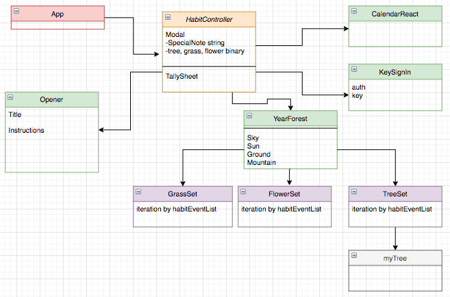

# _myForest_

TimeRecord  
Friday Feb 28  
8-9 --- Whiteboard and started building a calendar  
9-10 --- Broke everything and restarted (losing git history as i only had local commits and didn't push before deleting)  
10-11 --- Researched environment
11-12 --- Rebuild
12-12:30 --- update environment  
12:30-1:30 --- Webpack issues
1:30-2:30 --- Research and partial calendar  
3:30-5 --- Calendar tutorial

As you can see I had a bit of a rough start on Friday. I just kept at it and things finally worked out to a place that I feel I made progress. I know my commit history is kinda shotty, which is abnormal, but I had a few complete rebuilds that I just wanted in a different repo. My first submission has one of the earliest commits (https://github.com/JPForman/myForest.git , the earliest was deleted locally). Sorry for the confusion. I assure you I put in the hours from 8am-5, and most of the weekend thereafter.  

In terms of where my project status is, I have successfully built a calendar and created a visual landscape with tree components iterated through state input. I plan on connecting calendar based input with tree iteration (associating coordinates with date). From there I will create user authentication and connect the storage of data onto a database. Further features include the introduction of more elements (eg grass, flowers, etc.), classic graphs of personal data, birds flying in the functions of tracked data.  

#### _This is an application for tracking personal data in a visual way._

#### By _**Josh Forman**_

## Description

_This is an application for tracking personal data in a visual way. The user will be able to input data for any day and the forest will grow in relation._

_https://github.com/JPForman/Ganesha-Kambucha.git_

## Setup/Installation Requirements

* _$ git clone https://github.com/JPForman/my-forest.git  

* _$ cd my-forest_

* _$ npm install_

* _$ npm run start (browser will open to localhost:3000)_  

## Components

made at https://www.draw.io/

## Specs

* _The application allows the user to view, update, and create a forest based on date associated data input._

## Known Bugs

_a lot_

## Support and contact details

_Any questions, comments or contributions please contact Josh Forman (cyborgforman@gmail.com)_

## Technologies Used

_React, Webpack, CSS_

### License

*The MIT License

Permission is hereby granted, free of charge, to any person obtaining a copy
of this software and associated documentation files (the "Software"), to deal
in the Software without restriction, including without limitation the rights
to use, copy, modify, merge, publish, distribute, sublicense, and/or sell
copies of the Software, and to permit persons to whom the Software is
furnished to do so, subject to the following conditions:

The above copyright notice and this permission notice shall be included in
all copies or substantial portions of the Software.

THE SOFTWARE IS PROVIDED "AS IS", WITHOUT WARRANTY OF ANY KIND, EXPRESS OR
IMPLIED, INCLUDING BUT NOT LIMITED TO THE WARRANTIES OF MERCHANTABILITY,
FITNESS FOR A PARTICULAR PURPOSE AND NONINFRINGEMENT. IN NO EVENT SHALL THE
AUTHORS OR COPYRIGHT HOLDERS BE LIABLE FOR ANY CLAIM, DAMAGES OR OTHER
LIABILITY, WHETHER IN AN ACTION OF CONTRACT, TORT OR OTHERWISE, ARISING FROM,
OUT OF OR IN CONNECTION WITH THE SOFTWARE OR THE USE OR OTHER DEALINGS IN
THE SOFTWARE.*

Copyright (c) 2020 **_Josh Forman_**
